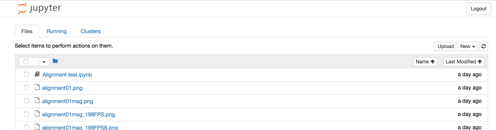
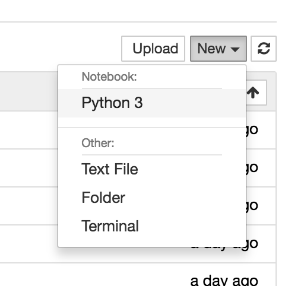
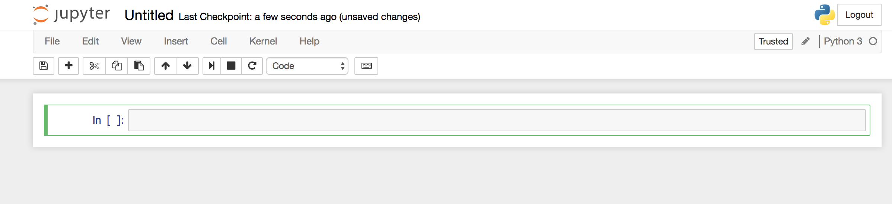

Minimal Jupyter HOWTO
======================

Launching Jupyter
-----------------

1. Open a terminal console on your data directory.

 + **On Mac**:

  i. Find "*Terminal.app*" application in your "*Applications/Utilities*" folder
  ii. Drag & drop the data folder on Terminal's icon
  
  this would be much easier if you have Terminal.app icon on the Dock.

 + **On Windows**:

  i. Go to your data directory in Explorer
  ii. *Shift+Right-click* on the background.
  iii. Click on "*Open command window here*" context menu.
  
  On Windows 8.1, you can do it from "*File*" menu on the window.

2. Launch Jupyter from the terminal console

 Just type on the terminal console prompt::

   jupyter notebook

 In some environments, the default web browser window will show up.

 If not, copy the link that appears on the terminal console and paste it on your web browser.

Create a new "notebook"
-----------------------

The resulting window lists the directory that you specified. Here, you can create/rename/delete files in the directory.

   Jupyter main window.

If you want to start a new analysis session, you need to create a new "notebook" file. Find the dropdown menu on the top-right corner that says "*New*". Click on it and further click on the item "*Python*".

   Creating a new notebook.

This will cause another browser window to open, where you can perform analyses. 

   Generated "Untitled" notebook.

(TODO: the way you can work in a 'notebook')

Building a basic analysis environment
--------------------------------------

A typical first cell
^^^^^^^^^^^^^^^^^^^^^

A typical first cell would look like:

.. code-block:: python
   
   %matplotlib Tk

   import math
   import numpy as np
   import pandas as pd
   import matplotlib.pyplot as plt

Imports that you may need
^^^^^^^^^^^^^^^^^^^^^^^^^^

The libraries that are imported above is what you may need quite often. Alias names (such as "np" and "pd") are just my convention, and you can name them as you want.

+ ``math`` -- contains functions for primitive (integral and floating-point) numbers such as ``pow()`` or ``sqrt()``.
+ ``numpy`` -- a fast library that handles multi-dimensional arrays.
+ ``pandas`` -- a library that handles data tables (i.e. a set of arrays with different value types and headers).
+ ``matplotlib.pyplot`` -- a library for figure-grade graph generation.

Configuring plotting environment
^^^^^^^^^^^^^^^^^^^^^^^^^^^^^^^^^

Normally, any plotting calls to ``matplotlib`` cannot be seen unless you explicitly ``save()`` the figure. On the other hand, you can configure matplotlib to render the figure as you write the code without saving it (the rendering engine used here is often called a "backend" of matplotlib).

The orthodox way to set the backend is quite troublesome, but you can set it in Jupyter in a simple line of 'magic' code::

   %matplotlib <backend name here>

Below are some possible backends:

============= ================= ============= ================ =========================================================
Backend name  Required library  Interactive?  Plot location    Note
============= ================= ============= ================ =========================================================
``inline``    (none)            No            On the notebook  
``tk``        Tkinter           Yes           New window       you may need to re-install ActiveTcl
``qt``        PyQt              Yes           New window       you can specify the PyQt version such as ``qt4`` ``qt5``
============= ================= ============= ================ =========================================================

+ "**Interactive: No**" means your graph will not get plotted until you call ``show()`` function. 
+ "**Interactive: Yes**"" means the figure window shows up as you code. You can also specify x- and y- ranges, as well as the other graphic parameters, on the graph window.

Auto-completion and help
------------------------

+ Hitting a tab-key will make auto-completion to occur
+ Pressing Shift+Tab will display function/method documentation

